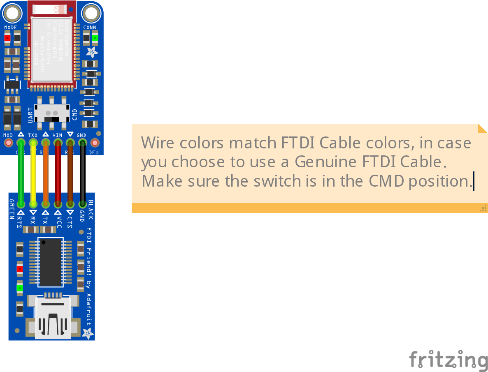

# bluefruit-rename

This repository contains a script to help mass-reprogram [Adafruit Bluefruit LE UART Friend](https://www.adafruit.com/product/2479)s, using UART cable that supports flow control. A 3.3V cable is recommended, but a 5V cable will work.  

The circuit needs to be wired as follows:  
  

The following cables are known to work:  
* [FTDI Friend](https://www.adafruit.com/product/284)  
* [FTDI Serial TTL-232 USB Cable](https://www.adafruit.com/product/70)  
* [TTL-232R-3V3](https://ftdichip.com/products/ttl-232r-3v3/)  
* [TTL-232R-5V](https://ftdichip.com/products/ttl-232r-5v/)  

Note that a cable that supports flow control is required! It needs to be setup for RTS/CTS flow control. or example, the following cables will not work:  
* [USB to TTL Serial Cable - Debug / Console Cable for Raspberry Pi](https://www.adafruit.com/product/954)  
* [SparkFun Beefy 3 - FTDI Basic Breakout](https://www.sparkfun.com/products/13746)  
* [SparkFun Serial Basic Breakout - CH340G](https://www.sparkfun.com/products/14050)  
* [SparkFun Serial Basic Breakout - CH340C and USB-C](https://www.sparkfun.com/products/15096)  
* [LilyPad FTDI Basic Breakout - 5V](https://www.sparkfun.com/products/10275)  
* [USB to TTL Serial Cable (5V VCC)](https://www.sparkfun.com/products/17831)  
* [SparkFun FTDI Basic Breakout - 3.3V](https://www.sparkfun.com/products/9873)  
* [SparkFun FTDI Basic Breakout - 5V](https://www.sparkfun.com/products/9716)  
